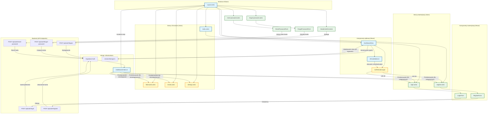

```mermaid
flowchart TD
    %% Main Application Structure
    subgraph "Struktura Główna"
        Layout["Layout.astro"]
    end

    %% Authentication Pages
    subgraph "Strony Autentykacji (Astro)"
        LoginPage["login.astro"]
        RegisterPage["register.astro"] 
        ForgotPwdPage["forgot-password.astro"]
        ResetPwdPage["reset-password.astro"]
    end

    %% Protected Pages
    subgraph "Strony Chronione (Astro)"
        MainPage["index.astro"]
        FlashcardsPage["flashcards.astro"]
        ReviewPage["review.astro"]
        SettingsPage["settings.astro"]
    end

    %% React Components
    subgraph "Komponenty Autentykacji (React)"
        LoginForm["LoginForm"]
        RegisterForm["RegisterForm"]
        ForgotPasswordForm["ForgotPasswordForm"]
        ResetPasswordForm["ResetPasswordForm"]
        HeaderAuthControls["HeaderAuthControls"]
    end

    subgraph "Komponenty Aplikacji (React)"
        DashboardView["DashboardView"]
        AICandidateList["AICandidateList"]
        CallToActionLogin["CallToActionLogin"]
    end

    %% Backend Structure
    subgraph "Backend (API Endpoints)"
        LoginAPI["POST /api/auth/login"]
        RegisterAPI["POST /api/auth/register"]
        LogoutAPI["POST /api/auth/logout"]
        ForgotPwdAPI["POST /api/auth/forgot-password"]
        ResetPwdAPI["POST /api/auth/reset-password"]
    end

    %% Core Services
    subgraph "Usługi i Infrastruktura"
        Middleware["middleware/index.ts"]
        SupabaseAuth["Supabase Auth"]
        SessionStorage["sessionStorage.ts"]
    end

    %% Connections - Component Hierarchy
    Layout --> HeaderAuthControls
    Layout --> MainPage
    Layout --> LoginPage
    Layout --> RegisterPage
    Layout --> ForgotPwdPage
    Layout --> ResetPwdPage
    Layout --> FlashcardsPage
    Layout --> ReviewPage
    Layout --> SettingsPage

    %% Page to Component Associations
    LoginPage --> LoginForm
    RegisterPage --> RegisterForm
    ForgotPwdPage --> ForgotPasswordForm
    ResetPwdPage --> ResetPasswordForm
    MainPage --> DashboardView

    %% Auth Component API Calls
    LoginForm -- "Zaloguj" --> LoginAPI
    RegisterForm -- "Zarejestruj" --> RegisterAPI
    HeaderAuthControls -- "Wyloguj" --> LogoutAPI
    ForgotPasswordForm -- "Zresetuj hasło" --> ForgotPwdAPI
    ResetPasswordForm -- "Ustaw nowe hasło" --> ResetPwdAPI

    %% API to Services
    LoginAPI -- "Uwierzytelnienie" --> SupabaseAuth
    RegisterAPI -- "Utworzenie konta" --> SupabaseAuth
    LogoutAPI -- "Wylogowanie" --> SupabaseAuth
    ForgotPwdAPI -- "Inicjacja resetu" --> SupabaseAuth
    ResetPwdAPI -- "Reset hasła" --> SupabaseAuth

    %% Auth Flow and Session Management
    SupabaseAuth --> Middleware
    Middleware -- "Kontekst sesji" --> Layout
    
    %% Guest State Management
    DashboardView --"Generowanie (gość)"--> SessionStorage
    DashboardView --> AICandidateList
    DashboardView --> CallToActionLogin
    
    %% Auth-dependent Components
    AICandidateList -- "Warunek: isAuthenticated" --> CallToActionLogin
    
    %% Login Prompt
    CallToActionLogin -- "Link do" --> LoginPage
    CallToActionLogin -- "Link do" --> RegisterPage
    
    %% Session Restoration
    SessionStorage -- "Załadowanie stanu po logowaniu" --> DashboardView

    %% Protected Routes Flow
    Middleware -- "Przekierowanie dla niezalogowanych" --> FlashcardsPage
    Middleware -- "Przekierowanie dla niezalogowanych" --> ReviewPage
    Middleware -- "Przekierowanie dla niezalogowanych" --> SettingsPage
    Middleware -- "Przekierowanie dla zalogowanych" --> LoginPage
    Middleware -- "Przekierowanie dla zalogowanych" --> RegisterPage

    %% Styles
    classDef existingComponent fill:#e1f5fe,stroke:#01579b,stroke-width:2px;
    classDef newComponent fill:#e8f5e9,stroke:#2e7d32,stroke-width:2px;
    classDef modifiedComponent fill:#fff9c4,stroke:#f57f17,stroke-width:2px;
    
    class Layout,Middleware,MainPage,DashboardView,AICandidateList existingComponent;
    class LoginPage,RegisterPage,ForgotPwdPage,ResetPwdPage,LoginForm,RegisterForm,ForgotPasswordForm,ResetPasswordForm,HeaderAuthControls newComponent;
    class CallToActionLogin,FlashcardsPage,ReviewPage,SettingsPage modifiedComponent;
```
